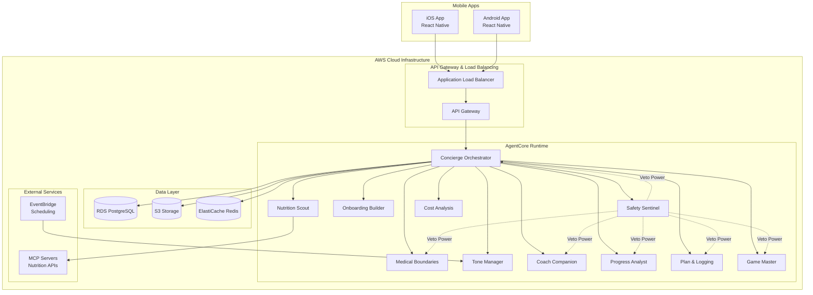

# Design Document: Vitracka Weight Management System

## Overview

Vitracka is a safety-first, AI-enabled mobile application that provides personalized weight management support through a sophisticated multi-agent architecture. The system combines behavioral coaching, progress tracking, and gamification while maintaining strict safety guardrails around mental health and medical boundaries.

The architecture leverages AWS Bedrock AgentCore with Strands Agents to create a modular, explainable system where each agent has specialized responsibilities. The Safety Sentinel agent maintains veto power over all other agents to ensure user safety is never compromised.

## Architecture

### High-Level System Architecture



### Multi-Agent Architecture

The system implements a hierarchical agent structure where the Concierge Orchestrator manages request routing while the Safety Sentinel maintains oversight authority. The Cost Analysis agent operates independently to monitor business metrics:

1. **Concierge Orchestrator**: Primary interface and request router
2. **Safety Sentinel**: Continuous monitoring with veto power
3. **Specialized Agents**: Domain-specific functionality (coaching, tracking, gamification)
4. **Cost Analysis Agent**: Business intelligence and profitability monitoring (admin-facing)

### Scalability and International Design

**AWS Infrastructure**: Initially deployed in eu-west-2 with design for seamless international expansion:
- **Infrastructure as Code**: Complete Terraform scripts for reproducible deployments
- **Auto-scaling Groups**: Automatic scaling based on user demand and agent workload
- **Multi-AZ Deployment**: High availability across multiple availability zones
- **CloudFront CDN**: Global content delivery with regional edge locations
- **Route 53**: DNS management with latency-based routing for future regions
- **RDS Multi-AZ**: Database replication for high availability and read scaling
- **ElastiCache Clusters**: Redis clusters with automatic failover

**Cost-Effective Scaling**:
- **Lambda Functions**: Serverless scaling for lightweight agent operations
- **ECS Fargate**: Container-based scaling for compute-intensive agent workloads
- **S3 Intelligent Tiering**: Automatic cost optimization for user data storage
- **CloudWatch Metrics**: Real-time monitoring for proactive scaling decisions

**International Expansion Ready**:
- **Localization Framework**: Multi-language support built into React Native app
- **Regional Data Compliance**: GDPR-compliant data handling with region-specific storage
- **Currency Support**: Multi-currency pricing and subscription management
- **Time Zone Awareness**: Coaching and notifications adapted to user time zones

### Infrastructure as Code (Terraform)

**Terraform Architecture**: Complete infrastructure deployment and management through Terraform scripts:

**Core Infrastructure Modules**:
- **Networking Module**: VPC, subnets, security groups, NAT gateways
- **Compute Module**: ECS clusters, Auto Scaling Groups, Lambda functions
- **Database Module**: RDS PostgreSQL with Multi-AZ, ElastiCache Redis clusters
- **Storage Module**: S3 buckets with intelligent tiering, CloudFront distributions
- **Security Module**: IAM roles, policies, KMS keys, AWS Secrets Manager
- **Monitoring Module**: CloudWatch dashboards, alarms, log groups
- **AgentCore Module**: Bedrock AgentCore runtime and gateway configuration

**Environment Management**:
- **Development Environment**: Single-AZ deployment for cost optimization
- **Staging Environment**: Production-like setup for testing
- **Production Environment**: Multi-AZ, high availability configuration
- **Disaster Recovery**: Cross-region backup and failover capabilities

**Terraform State Management**:
- **Remote State**: S3 backend with DynamoDB locking
- **State Encryption**: KMS encryption for sensitive infrastructure data
- **Workspace Separation**: Isolated state files per environment
- **Version Control**: Git-based infrastructure change tracking

**Deployment Pipeline**:
- **CI/CD Integration**: Terraform plan/apply through GitHub Actions or AWS CodePipeline
- **Infrastructure Validation**: Automated testing of Terraform configurations
- **Blue-Green Deployments**: Zero-downtime infrastructure updates
- **Rollback Capabilities**: Quick reversion to previous infrastructure states

## Components and Interfaces

### Mobile Application Layer

**Technology Stack**: React Native with TypeScript
- **Shared Codebase**: Single codebase for iOS and Android
- **State Management**: Redux Toolkit for predictable state updates
- **Navigation**: React Navigation for cross-platform navigation
- **UI Framework**: React Native Elements with platform-specific theming
- **Real-time Communication**: WebSocket connection for agent interactions

**Key Mobile Components**:
- **Authentication Module**: Multi-method secure login supporting email/password, Google ID, Facebook ID, and biometric authentication
- **Onboarding Flow**: Multi-step profile creation with progress saving
- **Dashboard**: Weight trends, progress visualization, daily coaching
- **Logging Interface**: Weight entry, meal logging, breach recording
- **Settings Panel**: Tone adjustment, notification preferences, profile updates
- **Safety Interface**: Crisis resources, professional help contacts

### Agent Layer

#### Concierge Orchestrator Agent
**Responsibilities**:
- Route incoming requests to appropriate specialist agents
- Compose multi-agent responses into coherent user interactions
- Manage conversation context and user session state
- Coordinate between agents while respecting Safety Sentinel authority

**Interfaces**:
- Mobile API endpoints for all user interactions
- Internal agent communication protocols
- User Support Profile access for personalization
- Session management and context preservation

#### Safety Sentinel Agent
**Responsibilities**:
- Continuous monitoring of all user inputs and agent outputs
- Detection of mental health crisis indicators, eating disorder signals, self-harm mentions
- Immediate intervention with veto power over other agents
- Escalation protocols for serious safety concerns
- Mandatory logging of all safety-related interactions

**Detection Patterns**:
- Eating disorder keywords: "purge", "starve", "restrict", "binge"
- Self-harm indicators: "hurt myself", "not worth it", "end it all"
- Extreme weight loss goals: BMI targets below healthy ranges
- Medication misuse: "skip doses", "double dose", "stop taking"

**Intervention Protocols**:
- Immediate gentle but firm response with professional help resources
- Override any conflicting agent responses
- Mandatory logging with admin notification flags
- Follow-up check-ins for users who trigger safety protocols

#### Medical Boundaries Agent
**Responsibilities**:
- Ensure consistent messaging about medical advice limitations
- Insert appropriate clinician referral prompts
- Monitor for medical advice requests and redirect appropriately
- Maintain clear boundaries around diagnosis and treatment

#### Coach Companion Agent
**Responsibilities**:
- Provide daily encouragement and behavioral guidance
- Adapt coaching style based on User Support Profile
- Frame setbacks as learning opportunities rather than failures
- Support habit formation and long-term sustainability

**Coaching Styles**:
- **Gentle**: Soft encouragement, minimal pressure, focus on self-compassion
- **Pragmatic**: Practical advice, problem-solving focus, realistic expectations
- **Upbeat**: Enthusiastic support, celebration of small wins, motivational language
- **Structured**: Clear guidelines, systematic approach, detailed planning

#### Progress Analyst Agent
**Responsibilities**:
- Analyze weight trends using rolling averages and statistical methods
- Generate insights for graphical display in mobile app
- Detect concerning patterns (rapid loss, plateau frustration, yo-yo cycles)
- Provide data-driven feedback while maintaining encouraging tone

**Analytics Capabilities**:
- 7-day, 30-day, and 90-day trend analysis
- Correlation analysis between logging consistency and progress
- Plateau detection and adaptive recommendations
- Success pattern recognition for personalized insights

#### Cost Analysis Agent
**Responsibilities**:
- Monitor AWS infrastructure costs and usage patterns
- Analyze per-user operational costs across all services
- Track agent interaction costs and resource utilization
- Generate profitability reports and subscription pricing recommendations
- Provide cost optimization suggestions for infrastructure scaling

**Business Intelligence Capabilities**:
- Real-time cost monitoring across all AWS services
- User acquisition cost (CAC) and lifetime value (LTV) analysis
- Subscription tier profitability modeling
- Resource utilization forecasting for capacity planning
- Cost per interaction analysis for agent optimization

**Admin Dashboard Integration**:
- Daily/weekly/monthly cost reports
- Subscription pricing optimization recommendations
- Infrastructure scaling cost projections
- Profitability alerts and threshold monitoring

### Data Models

#### User Authentication
```typescript
interface UserAccount {
  id: string;
  email?: string; // Required for email/password auth
  passwordHash?: string; // Hashed password, never stored in plain text
  googleId?: string; // Google OAuth identifier
  facebookId?: string; // Facebook OAuth identifier
  authMethod: 'email' | 'google' | 'facebook';
  emailVerified: boolean;
  createdAt: Date;
  lastLoginAt: Date;
  isActive: boolean;
}

interface AuthenticationRequest {
  method: 'email' | 'google' | 'facebook';
  credentials: {
    email?: string;
    password?: string; // Plain text, hashed before storage
    oauthToken?: string; // For Google/Facebook OAuth
  };
}
```

#### User Support Profile
```typescript
interface UserSupportProfile {
  userId: string; // Links to UserAccount.id
  accountId: string; // Reference to UserAccount
  goals: {
    type: 'loss' | 'maintenance' | 'transition';
    targetWeight?: number;
    timeframe?: string;
    weeklyGoal?: number;
  };
  preferences: {
    coachingStyle: 'gentle' | 'pragmatic' | 'upbeat' | 'structured';
    gamificationLevel: 'minimal' | 'moderate' | 'high';
    notificationFrequency: 'daily' | 'weekly' | 'custom';
    reminderTimes: string[];
  };
  medicalContext: {
    onGLP1Medication: boolean;
    hasClinicianGuidance: boolean;
    medicationDetails?: string;
  };
  safetyProfile: {
    riskFactors: string[];
    triggerWords: string[];
    interventionHistory: SafetyIntervention[];
  };
  createdAt: Date;
  updatedAt: Date;
}
```

#### Weight Entry
```typescript
interface WeightEntry {
  id: string;
  userId: string;
  weight: number;
  unit: 'kg' | 'lbs';
  timestamp: Date;
  notes?: string;
  mood?: 'great' | 'good' | 'okay' | 'struggling';
  confidence: number; // 1-5 scale
}
```

#### Eating Plan
```typescript
interface EatingPlan {
  id: string;
  userId: string;
  type: 'calorie' | 'points' | 'plate' | 'custom';
  dailyTarget: number;
  restrictions: string[];
  preferences: string[];
  isActive: boolean;
  createdAt: Date;
}
```

#### Safety Intervention
```typescript
interface SafetyIntervention {
  id: string;
  userId: string;
  triggerType: 'eating_disorder' | 'self_harm' | 'depression' | 'medical_emergency';
  triggerContent: string;
  agentResponse: string;
  escalationLevel: 'low' | 'medium' | 'high' | 'critical';
  adminNotified: boolean;
  followUpRequired: boolean;
  timestamp: Date;
}
```

#### Cost Analysis Models
```typescript
interface CostMetrics {
  id: string;
  timestamp: Date;
  period: 'hourly' | 'daily' | 'weekly' | 'monthly';
  totalCost: number;
  costBreakdown: {
    agentCore: number;
    database: number;
    storage: number;
    networking: number;
    externalAPIs: number;
  };
  userCount: number;
  costPerUser: number;
  agentInteractions: number;
  costPerInteraction: number;
}

interface SubscriptionRecommendation {
  id: string;
  generatedAt: Date;
  recommendedTiers: {
    tierName: string;
    monthlyPrice: number;
    features: string[];
    targetMargin: number;
    projectedUsers: number;
  }[];
  costBasis: {
    avgCostPerUser: number;
    infrastructureOverhead: number;
    targetProfitMargin: number;
  };
  validUntil: Date;
}

interface InternationalizationConfig {
  region: string;
  currency: string;
  language: string;
  dataResidency: string;
  complianceRequirements: string[];
  localizedPricing: {
    currency: string;
    exchangeRate: number;
    localAdjustments: number;
  };
}

interface TerraformConfiguration {
  environment: 'development' | 'staging' | 'production';
  region: string;
  availabilityZones: string[];
  resourceTags: {
    Project: string;
    Environment: string;
    Owner: string;
    CostCenter: string;
  };
  scalingConfig: {
    minInstances: number;
    maxInstances: number;
    targetCPUUtilization: number;
    targetMemoryUtilization: number;
  };
  backupConfig: {
    retentionDays: number;
    crossRegionReplication: boolean;
    encryptionEnabled: boolean;
  };
}
```

## Correctness Properties

*A property is a characteristic or behavior that should hold true across all valid executions of a system—essentially, a formal statement about what the system should do. Properties serve as the bridge between human-readable specifications and machine-verifiable correctness guarantees.*

Now I need to analyze the acceptance criteria to determine which ones can be tested as properties. Let me use the prework tool to analyze the testability of each acceptance criterion.

### Converting EARS to Properties

Based on the prework analysis, I'll convert the testable acceptance criteria into universally quantified properties, combining related criteria to eliminate redundancy:

**Property 1: Authentication Security**
*For any* authentication request, the system should validate credentials securely, hash passwords before storage (never storing plain text), support multiple authentication methods (email/password, Google ID, Facebook ID), and maintain proper session management
**Validates: Requirements 19.1, 19.2, 19.3**

**Property 2: Profile Management Consistency**
*For any* valid onboarding completion or profile update request, the system should generate and persist a complete User_Support_Profile with all required fields populated
**Validates: Requirements 1.4, 1.5**

**Property 3: Safety Intervention Authority**
*For any* user input containing safety trigger words (eating disorder, self-harm, depression indicators), the Safety_Sentinel should detect the signal, generate an appropriate intervention response, override any conflicting agent responses, and create a mandatory audit log entry
**Validates: Requirements 2.4, 2.5, 2.6, 11.3**

**Property 4: Medical Boundary Enforcement**
*For any* request for medical advice, diagnosis, or treatment recommendations, the system should defer to clinicians and provide appropriate professional referral guidance
**Validates: Requirements 2.2, 2.3**

**Property 5: Healthy Weight Boundaries**
*For any* weight loss goal or recommendation, the system should ensure gradual sustainable rates, reject unhealthily low targets, and recognize maintenance as success when healthy weight is achieved
**Validates: Requirements 2.7, 2.8, 2.9**

**Property 6: Adaptive Coaching Consistency**
*For any* coaching response generation, the output should match the user's specified tone preference, contain encouraging language, avoid shame-based content, and adapt appropriately for GLP-1 medication users
**Validates: Requirements 3.1, 3.2, 3.3, 8.1, 8.2, 8.3**

**Property 7: Weight Data Integrity**
*For any* weight entry, the system should accept valid inputs, store them securely, and display trends using rolling averages that emphasize long-term patterns over daily fluctuations
**Validates: Requirements 4.1, 4.2, 4.3, 4.4**

**Property 8: Breach Recovery Support**
*For any* eating plan breach event, the system should encourage honest logging without shame, frame the breach as recoverable, provide recovery guidance, and offer gamification incentives for plan resumption
**Validates: Requirements 5.3, 5.4, 5.5, 7.5, 7.6**

**Property 9: Adherence Tracking Accuracy**
*For any* eating plan and logging history, the system should calculate accurate adherence metrics and track them over time
**Validates: Requirements 5.2**

**Property 10: Nutrition Search Completeness**
*For any* nutritional search query, the system should return relevant food items with pricing information and suggest healthier or cheaper alternatives when available, while avoiding extreme restriction strategies
**Validates: Requirements 6.1, 6.2, 6.3, 6.4**

**Property 11: Safe Gamification Logic**
*For any* gamification reward generation, the system should reward consistency and honesty while avoiding reinforcement of starvation or extreme restriction behaviors, adapting to user preferences
**Validates: Requirements 7.2, 7.3, 7.4**

**Property 12: Agent Architecture Integrity**
*For any* system request, the Concierge_Orchestrator should route it appropriately, maintain functional separation between agent types, and respect Safety_Sentinel veto authority
**Validates: Requirements 9.1, 9.2, 9.3**

**Property 13: Notification Control Compliance**
*For any* notification setting change, the system should respect user preferences for delivery methods, timing, and frequency, while providing opt-out options for non-critical notifications
**Validates: Requirements 10.2, 10.3, 10.4, 10.5**

**Property 14: Comprehensive Audit Logging**
*For any* agent interaction or system decision, appropriate log entries should be created with special flagging for safety-related events and secure storage in accordance with data security requirements
**Validates: Requirements 11.1, 11.2, 11.3**

**Property 15: External Data Integration Reliability**
*For any* external nutrition data request, the system should access real-time information through approved APIs, validate and sanitize the data, handle service interruptions gracefully, and maintain interoperability across multiple sources
**Validates: Requirements 12.2, 12.3, 12.4, 12.5**

**Property 16: Data Portability Compliance**
*For any* user data export or deletion request, the system should process it completely and accurately within required timeframes
**Validates: Requirements 19.4**

**Property 17: Cost Analysis and Profitability Monitoring**
*For any* operational period, the Cost Analysis agent should accurately track infrastructure costs, calculate per-user costs, generate subscription pricing recommendations, and provide profitability insights for business decision-making
**Validates: Requirements 16.1, 16.2, 16.3**

**Property 18: Scalable Infrastructure Performance**
*For any* increase in user demand, the system should automatically scale resources cost-effectively while maintaining performance standards and user experience quality
**Validates: Requirements 16.4, 16.5**

**Property 19: Infrastructure as Code Consistency**
*For any* environment deployment (development, staging, production), Terraform scripts should create consistent, reproducible infrastructure with proper state management, version control, and rollback capabilities
**Validates: Requirements 17.1, 17.2**

**Property 20: Cross-Platform Feature Parity**
*For any* feature available on one mobile platform, equivalent functionality should be available on the other platform
**Validates: Requirements 18.3**

## Error Handling

### Safety-Critical Error Handling

**Safety Sentinel Failures**: If the Safety Sentinel agent becomes unavailable, the system must enter a safe mode where:
- All potentially harmful responses are blocked
- Users receive gentle messages directing them to professional resources
- System administrators are immediately notified
- No coaching or advice is provided until Safety Sentinel is restored

**Medical Boundary Violations**: If any agent attempts to provide medical advice:
- The Medical Boundaries Agent immediately intercepts and overrides the response
- A standard disclaimer and clinician referral is provided instead
- The violation is logged for system improvement
- The offending agent's response patterns are reviewed

### Data and Integration Error Handling

**External API Failures**: When nutrition or pricing APIs are unavailable:
- Cached data is used when available and recent
- Users are informed of potential data staleness
- Basic functionality continues without external enhancements
- Automatic retry mechanisms attempt reconnection

**Database Connection Issues**: During data persistence failures:
- Critical user data (weight entries, safety flags) is cached locally
- Users are notified of temporary sync issues
- Automatic retry and recovery mechanisms activate
- Data integrity checks ensure no loss upon reconnection

**Agent Communication Failures**: When inter-agent communication fails:
- The Concierge Orchestrator provides fallback responses
- Users receive acknowledgment that their request is being processed
- Failed requests are queued for retry when agents recover
- System degradation is graceful rather than complete failure

### User Experience Error Handling

**Invalid Input Handling**: For malformed or inappropriate user inputs:
- Clear, helpful error messages guide users toward correct input
- Previous valid data is preserved during correction attempts
- Multiple input formats are accepted where possible
- Accessibility considerations ensure error messages are screen-reader friendly

**Session Management**: During authentication or session issues:
- Users are gracefully redirected to re-authentication
- In-progress data entry is preserved when possible
- Biometric authentication provides seamless re-entry
- Offline capability maintains core functionality during connectivity issues

## Testing Strategy

### Dual Testing Approach

The Vitracka system requires both unit testing and property-based testing to ensure comprehensive coverage:

**Unit Tests** focus on:
- Specific examples of safety interventions with known trigger phrases
- Edge cases in weight calculation and trend analysis
- Integration points between mobile app and agent layer
- Error conditions and fallback behaviors
- Platform-specific functionality on iOS and Android

**Property-Based Tests** focus on:
- Universal properties that hold across all user inputs and system states
- Comprehensive input coverage through randomization
- Safety properties that must never be violated regardless of input
- Data integrity properties across all user interactions
- Agent behavior consistency across different user profiles

### Property-Based Testing Configuration

**Framework**: We'll use **fast-check** for TypeScript/JavaScript property-based testing, integrated with Jest for the React Native mobile app and Node.js backend services.

**Test Configuration**:
- Minimum 100 iterations per property test to ensure thorough coverage
- Each property test references its corresponding design document property
- Tag format: **Feature: vitracka-weight-management, Property {number}: {property_text}**
- Custom generators for User_Support_Profile, WeightEntry, and safety trigger content
- Shrinking enabled to find minimal failing examples when properties are violated

**Critical Property Test Examples**:

```typescript
// Property 2: Safety Intervention Authority
describe('Safety Intervention Authority', () => {
  it('should detect and intervene on safety triggers', 
    fc.property(
      fc.record({
        message: fc.string(),
        triggerWords: fc.array(fc.constantFrom('purge', 'starve', 'hurt myself', 'not worth it'))
      }),
      (input) => {
        // Feature: vitracka-weight-management, Property 2: Safety Intervention Authority
        const containsTrigger = input.triggerWords.some(word => 
          input.message.toLowerCase().includes(word.toLowerCase())
        );
        
        if (containsTrigger) {
          const response = safetySentinel.processMessage(input.message);
          expect(response.isIntervention).toBe(true);
          expect(response.includesProfessionalHelp).toBe(true);
          expect(response.overridesOtherAgents).toBe(true);
          expect(auditLog.hasEntry(input.message, 'SAFETY_INTERVENTION')).toBe(true);
        }
      }
    )
  );
});

// Property 4: Healthy Weight Boundaries  
describe('Healthy Weight Boundaries', () => {
  it('should enforce healthy weight loss rates and targets',
    fc.property(
      fc.record({
        currentWeight: fc.float({min: 40, max: 200}),
        targetWeight: fc.float({min: 30, max: 200}),
        timeframe: fc.integer({min: 1, max: 104}) // weeks
      }),
      (goal) => {
        // Feature: vitracka-weight-management, Property 4: Healthy Weight Boundaries
        const recommendation = weightGoalValidator.validateGoal(goal);
        
        const weeklyLossRate = (goal.currentWeight - goal.targetWeight) / goal.timeframe;
        const bmi = calculateBMI(goal.targetWeight, assumedHeight);
        
        if (weeklyLossRate > 2.0 || bmi < 18.5) {
          expect(recommendation.isAccepted).toBe(false);
          expect(recommendation.suggestsModification).toBe(true);
        }
      }
    )
  );
});
```

### Unit Testing Balance

Unit tests complement property-based tests by focusing on:
- **Specific Safety Scenarios**: Test known problematic phrases and expected interventions
- **Integration Testing**: Verify mobile app communicates correctly with agent layer
- **Platform-Specific Features**: Test iOS HealthKit and Android Health Connect integrations
- **Error Recovery**: Test specific failure scenarios and recovery mechanisms
- **User Interface Logic**: Test React Native component behavior and state management

**Example Unit Tests**:

```typescript
describe('Safety Sentinel Integration', () => {
  it('should immediately intervene on eating disorder language', async () => {
    const message = "I've been purging after every meal";
    const response = await safetySentinel.processMessage(message);
    
    expect(response.intervention).toContain('professional help');
    expect(response.overridesPriority).toBe(true);
    expect(mockAuditLogger.logSafetyEvent).toHaveBeenCalledWith(
      expect.objectContaining({
        triggerType: 'eating_disorder',
        escalationLevel: 'high'
      })
    );
  });
  
  it('should handle concurrent agent responses with safety override', async () => {
    const coachResponse = "Great job on your progress!";
    const safetyTrigger = "I want to hurt myself";
    
    const finalResponse = await conciergeOrchestrator.processMessage(safetyTrigger);
    
    expect(finalResponse).not.toContain(coachResponse);
    expect(finalResponse).toContain('professional support');
  });
});
```

This dual approach ensures that Vitracka maintains its safety-first principles while providing comprehensive test coverage across all system behaviors and user interactions.